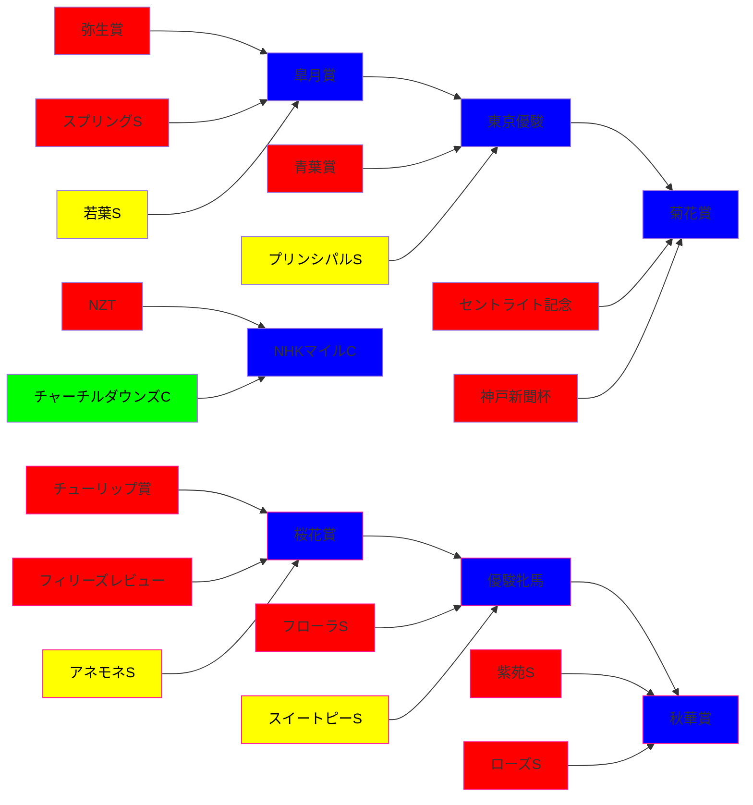

# horserace-flowchart

競馬のローテーションをフローチャートで書いてみる

```mermaid
graph LR
    classDef G1 fill:#0000ff;
    classDef G2 fill:#ff0000;
    classDef G3 fill:#00ff00,color:#000000;
    classDef Listed fill:#ffff00,color:#000000;
    classDef female stroke:#ff1493;

    %% 朝日杯FS-->皐月賞
    %% ホープフルS-->皐月賞
    皐月賞-->東京優駿
    東京優駿-->菊花賞

    弥生賞-->皐月賞
    スプリングS-->皐月賞
    若葉S-->皐月賞

    青葉賞-->東京優駿
    プリンシパルS-->東京優駿
    セントライト記念-->菊花賞
    神戸新聞杯-->菊花賞

    NZT-->NHKマイルC
    チャーチルダウンズC-->NHKマイルC

    桜花賞-->優駿牝馬
    優駿牝馬-->秋華賞

    チューリップ賞-->桜花賞
    フィリーズレビュー-->桜花賞
    アネモネS-->桜花賞

    フローラS-->優駿牝馬
    スイートピーS-->優駿牝馬

    紫苑S-->秋華賞
    ローズS-->秋華賞

    class 朝日杯FS,ホープフルS,皐月賞,東京優駿,菊花賞,NHKマイルC,桜花賞,優駿牝馬,秋華賞 G1
    class スプリングS,弥生賞,青葉賞,セントライト記念,神戸新聞杯,NZT,チューリップ賞,フィリーズレビュー,ローズS,紫苑S,フローラS G2
    class チャーチルダウンズC G3
    class 若葉S,プリンシパルS,アネモネS,スイートピーS Listed

    class 桜花賞,優駿牝馬,秋華賞,チューリップ賞,フィリーズレビュー,アネモネS,フローラS,スイートピーS,紫苑S,ローズS female

```
